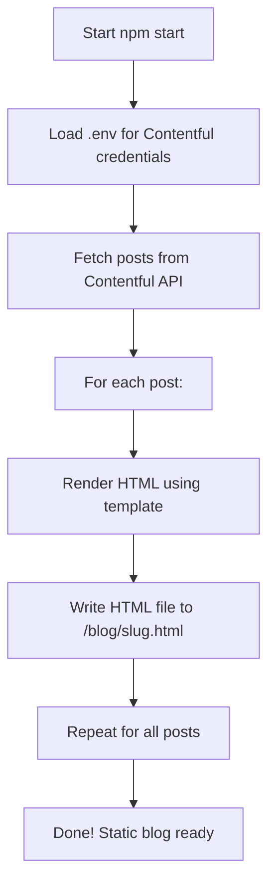

# DSEBest 📚✨


> **DSEBest** is a modern, mobile-first, PWA-enabled platform for HKDSE students, featuring past papers, notes, and blog posts — all delivered lightning-fast and offline-ready.


## 🚀 Features

- 📱 **PWA**: Installable, and native-like on iOS/iPadOS
- 📝 **Contentful-powered blog**: Dynamic posts, static HTML generation
- 📄 **Past Papers**: Fast PDF access via CDN
- 🌙 **Themes**: Light, dark, blue, and more
- ⚡ **Optimized**: Blazing fast, Google PageSpeed friendly
- 🧩 **No server-side code**: 100% static & CDN deployable


## 🛠️ Tech Stack

- HTML5, CSS3 (Sass), JavaScript (Vanilla)
- [Contentful](https://www.contentful.com/) (CMS)
- [Vercel](https://vercel.com/) (Hosting)
- [GitHub Actions](https://github.com/features/actions) (Automation)
- PWA (Service Worker, Manifest)


## 🧑‍💻 Contentful.JS SSG Instructions

1. **Install dependencies:**
   ```sh
   npm install
   ```
2. **Run the Contentful static site generator:**
   ```sh
   npm start
   ```
   - This will fetch posts from Contentful and generate static HTML files in the `/blog` directory.
   - Make sure your Contentful API keys are set in your environment variables.


## 🗺️ Contentful SSG Flowchart



## 🧩 Shortcode Documentation

### Button Shortcode

You can add beautiful, flexible buttons to your blog posts or pages using the following shortcode format in your Contentful content:

```
[button;TYPE;STYLE;LABEL;URL]
```

- `TYPE`: The button style. Supported values:
  - `gradient` (e.g. Gradient Primary)
  - `color` (e.g. Color Primary)
  - `raised` (e.g. Raised Primary)
  - `outline` (e.g. Outline Primary)
  - `inverse` (e.g. Inverse Primary)
  - `icon+ICONNAME` (for icon buttons, see below)
- `STYLE`: The color style. Supported values:
  - `primary`, `danger`, `success`, `info`, `warning`, `voilet`, `royal`, `branding`, `deep-blue`, `dark`, `secondary`, `light`
- `LABEL`: The text to display on the button
- `URL`: The link for the button

#### Examples

**Gradient Buttons**
```
[button;gradient;primary;Gradient Primary;https://example.com]
[button;gradient;danger;Gradient Danger;https://example.com]
```

**Color Buttons**
```
[button;color;primary;Color Primary;https://example.com]
[button;color;danger;Color Danger;https://example.com]
```

**Raised Buttons**
```
[button;raised;success;Raised Success;https://example.com]
```

**Outline Buttons**
```
[button;outline;info;Outline Info;https://example.com]
```

**Inverse Buttons**
```
[button;inverse;warning;Inverse Warning;https://example.com]
```

**Icon Buttons**
```
[button;icon+search;primary;Search;https://example.com]
[button;icon+home;danger;Home;https://example.com]
[button;icon+account_circle;success;Profile;https://example.com]
```
- The value after `icon+` is the Material Icons name (see https://fonts.google.com/icons for options).
- Icon buttons will have the icon before the label, with proper alignment and spacing.

#### Notes
- All buttons are responsive and use your template's styles.
- You can use these shortcodes anywhere in your Contentful content.
- If you use an unsupported type or style, the button will default to `gradient` and `primary`.
- If the URL contains HTML, the parser will attempt to extract the correct link.

---

*Made with ❤️ for HKDSE students.*
