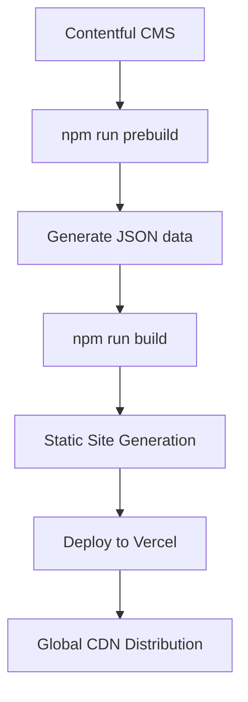

# DSEBest v2.0 ��📚

> **DSEBest** has evolved into a modern Next.js-powered platform for HKDSE students, featuring past papers, dynamic blog posts, and comprehensive study resources — all delivered through a lightning-fast, PWA-enabled experience.

## ✨ What's New in v2.0 (Next.js Evolution)

### � **Complete Architecture Overhaul**
- **From Static HTML → Next.js 15** with React 19
- **Server-Side Generation (SSG)** for optimal performance
- **TypeScript** throughout for better code quality
- **Enhanced PWA** with native iOS feel
- **Advanced Security Headers** for production-grade security

### � **Performance & UX Improvements**
- **Framer Motion** animations for smooth page transitions
- **Optimized bundle splitting** and code elimination
- **Enhanced SEO** with dynamic meta tags
- **Responsive design** optimized for all devices
- **Offline-first** PWA experience

### 📱 **Mobile-First PWA Features**
- **Installable** on iOS, Android, and Desktop
- **Native iOS gestures** and scroll behavior
- **Standalone app mode** with custom splash screens
- **Background sync** for offline content access

## 🛠️ Modern Tech Stack

### **Frontend Framework**
- **Next.js 15** (React 19, TypeScript)
- **Framer Motion** for animations
- **Bootstrap 5.3** with custom themes
- **Sass/SCSS** for advanced styling

### **Content Management**
- **Contentful CMS** with rich text rendering
- **Static generation** at build time
- **Dynamic imports** for optimal loading

### **Performance & Security**
- **Vercel Edge Network** deployment
- **Security headers** (CSP, HSTS, XSS protection)
- **Automatic optimization** (images, fonts, scripts)
- **Console.log removal** in production

### **Development & Deployment**
- **TypeScript** with strict type checking
- **ESLint** for code quality
- **Git workflow** with automated deployments
- **Environment variable** management

## 🚀 Quick Start

### **Development**
```bash
# Install dependencies
npm install

# Start development server
npm run dev

# Access at http://localhost:3000
```

### **Production Build**
```bash
# Generate blog data from Contentful
npm run prebuild

# Build for production
npm run build

# Start production server
npm start
```

### **Blog Content Management**
```bash
# Sync latest blog posts from Contentful
npm run blog:sync

# Full build with fresh content
npm run build:full
```

## 📁 Project Structure

```
├── pages/                  # Next.js pages (SSG)
│   ├── _app.tsx           # App wrapper with themes
│   ├── _document.tsx      # HTML document structure
│   ├── index.tsx          # Homepage
│   ├── [subject].tsx      # Subject pages
│   └── blog/
│       ├── index.tsx      # Blog listing
│       └── [slug].tsx     # Individual blog posts
├── components/            # Reusable React components
├── utils/                 # Utility functions
├── hooks/                 # Custom React hooks
├── types/                 # TypeScript type definitions
├── public/               # Static assets
│   ├── config/           # Subject configurations
│   ├── assets/           # Images, fonts, styles
│   └── manifest.json     # PWA manifest
├── data/                 # Generated blog data
└── contentful/           # Content generation scripts
```

## 🎨 Features & Capabilities

### **Study Resources**
- 📄 **Past Papers** for all HKDSE subjects (2012-2024)
- 📚 **Subject Pages** with organized resources
- 🔍 **Quick navigation** between years and papers
- 📱 **Mobile-optimized** PDF viewing

### **Dynamic Blog**
- ✍️ **Contentful-powered** content management
- 🏷️ **Rich text rendering** with embedded media
- 🔗 **SEO-optimized** with meta tags and structured data
- 📊 **Static generation** for fast loading

### **Progressive Web App**
- 📲 **Installable** on all devices
- 🔄 **Offline support** with service worker
- 🎯 **Native app feel** especially on iOS
- 🔔 **Push notifications** ready (when needed)

### **Theming System**
- 🎨 **Multiple themes**: Light, Dark, Blue, Semi-dark, Bordered
- 💾 **Persistent theme** selection
- 🔄 **Smooth transitions** between themes
- 📱 **System preference** detection

## 🔧 Configuration

### **Environment Variables**
```bash
# Contentful CMS
CONTENTFUL_SPACE_ID=your_space_id
CONTENTFUL_ACCESS_TOKEN=your_access_token
CONTENTFUL_ENVIRONMENT=master

# Optional: Preview mode
CONTENTFUL_PREVIEW_ACCESS_TOKEN=your_preview_token
```

### **Vercel Deployment**
```json
{
  "framework": "nextjs",
  "buildCommand": "npm run build:full",
  "installCommand": "npm install",
  "outputDirectory": ".next"
}
```

## 🔒 Security Features

- **Content Security Policy (CSP)** preventing XSS attacks
- **HTTP Strict Transport Security (HSTS)** enforcing HTTPS
- **X-Frame-Options** preventing clickjacking
- **Referrer Policy** controlling information leakage
- **Permissions Policy** restricting browser features

## 📈 Performance Optimizations

### **Build-time Optimizations**
- **Static Site Generation (SSG)** for all pages
- **Automatic code splitting** by Next.js
- **Tree shaking** removing unused code
- **Console.log removal** in production builds

### **Runtime Optimizations**
- **Prefetching** critical resources
- **Image optimization** with Next.js Image component
- **Font optimization** with Google Fonts
- **Script optimization** with consolidated inline scripts

### **CDN & Caching**
- **Vercel Edge Network** global distribution
- **Automatic caching** headers by Vercel
- **Static asset** optimization
- **Gzip compression** enabled

## 🧑‍💻 Development Workflow

### **Adding New Content**
1. **Blog Posts**: Add via Contentful CMS
2. **Subject Resources**: Update JSON configs in `/public/config/`
3. **Static Pages**: Create new `.tsx` files in `/pages/`

### **Content Generation Flow**


### **Theme Development**
1. **SCSS files** in `/public/sass/`
2. **Compile** to CSS with build process
3. **Theme switching** handled by JavaScript
4. **Persistent storage** in localStorage

## 🌐 Deployment

### **Vercel (Recommended)**
- **Automatic** deployments from Git
- **Preview** deployments for pull requests
- **Edge network** for global performance
- **Analytics** and monitoring included

### **Manual Deployment**
```bash
# Build static files
npm run build:full

# Deploy .next/out/ to any static host
```

## 📊 Analytics & Monitoring

- **Google Analytics 4** for user behavior tracking
- **Vercel Analytics** for performance insights
- **Vercel Speed Insights** for Core Web Vitals
- **Error tracking** with React error boundaries

## 🤝 Contributing

1. Fork the repository
2. Create feature branch (`git checkout -b feature/amazing-feature`)
3. Commit changes (`git commit -m 'Add amazing feature'`)
4. Push to branch (`git push origin feature/amazing-feature`)
5. Open Pull Request

## 📄 License

This project is licensed under the ISC License - see the [LICENSE](LICENSE) file for details.

## 🎯 Roadmap

- [ ] **Enhanced PWA** features (background sync, push notifications)
- [ ] **User accounts** and personalized study plans
- [ ] **Interactive practice** questions
- [ ] **AI-powered** study recommendations
- [ ] **Multi-language** support (English/Traditional Chinese)
- [ ] **Dark mode** enhancements
- [ ] **Advanced search** functionality

---

**Built with ❤️ for HKDSE students** | **Powered by Next.js & Vercel**
    F --> G[Repeat for all posts]
    G --> H[Done! Static blog ready]
```

## 🧩 Shortcode Documentation

### Button Shortcode

You can add beautiful, flexible buttons to your blog posts or pages using the following shortcode format in your Contentful content:

```
[button;TYPE;STYLE;LABEL;URL]
```

- `TYPE`: The button style. Supported values:
  - `gradient` (e.g. Gradient Primary)
  - `color` (e.g. Color Primary)
  - `raised` (e.g. Raised Primary)
  - `outline` (e.g. Outline Primary)
  - `inverse` (e.g. Inverse Primary)
  - `icon+ICONNAME` (for icon buttons, see below)
- `STYLE`: The color style. Supported values:
  - `primary`, `danger`, `success`, `info`, `warning`, `voilet`, `royal`, `branding`, `deep-blue`, `dark`, `secondary`, `light`
- `LABEL`: The text to display on the button
- `URL`: The link for the button

#### Examples

**Gradient Buttons**
```
[button;gradient;primary;Gradient Primary;https://example.com]
[button;gradient;danger;Gradient Danger;https://example.com]
```

**Color Buttons**
```
[button;color;primary;Color Primary;https://example.com]
[button;color;danger;Color Danger;https://example.com]
```

**Raised Buttons**
```
[button;raised;success;Raised Success;https://example.com]
```

**Outline Buttons**
```
[button;outline;info;Outline Info;https://example.com]
```

**Inverse Buttons**
```
[button;inverse;warning;Inverse Warning;https://example.com]
```

**Icon Buttons**
```
[button;icon+search;primary;Search;https://example.com]
[button;icon+home;danger;Home;https://example.com]
[button;icon+account_circle;success;Profile;https://example.com]
```
- The value after `icon+` is the Material Icons name (see https://fonts.google.com/icons for options).
- Icon buttons will have the icon before the label, with proper alignment and spacing.

#### Notes
- All buttons are responsive and use your template's styles.
- You can use these shortcodes anywhere in your Contentful content.
- If you use an unsupported type or style, the button will default to `gradient` and `primary`.
- If the URL contains HTML, the parser will attempt to extract the correct link.

---

## 📊 Download Analytics Guide

DSEBest automatically tracks all PDF downloads with detailed analytics. Here's how to view and analyze the data in Google Analytics 4.

### 🎯 What Gets Tracked Automatically

Every PDF download is automatically tracked with the following data:
- **Subject**: Math, English, Physics, Chemistry, Biology, etc.
- **Year**: 2012-2024 (extracted from filename)
- **Paper**: P1, P2, P3, P4, Answers, Performance
- **Type**: Practice, Sample, Regular, Bytopic, Exam
- **Language**: Chinese, English (detected from filename)
- **File Name**: Complete PDF filename
- **CDN URL**: Full download link

### 🔍 How to View Analytics Data

#### 1. Real-Time Testing (Immediate)
1. Go to **Google Analytics** → **Reports** → **Realtime**
2. Click a PDF download on your website
3. Look for these events in the Events section:
   - `file_download` (detailed tracking)
   - `pdf_download` (simplified tracking)

#### 2. Historical Data (24-48 hours)
1. **Reports** → **Engagement** → **Events**
2. Click on `file_download` or `pdf_download`
3. View event parameters for detailed breakdown

### 📈 Creating Custom Reports

#### Most Downloaded Subjects
1. **Reports** → **Engagement** → **Events** → `file_download`
2. Add **Secondary dimension** → **Custom parameters** → `download_subject`
3. Sort by **Event count** (descending)

**Result**: Math (350 downloads), English (280 downloads), Physics (220 downloads)

#### Popular Years Analysis
1. Same as above, but use `download_year` as secondary dimension
2. **Result**: 2023 (400 downloads), 2022 (350 downloads), 2021 (300 downloads)

#### Paper Type Preferences
1. Use `download_paper` as secondary dimension
2. **Result**: P1 (300 downloads), Answers (250 downloads), P2 (200 downloads)

#### Language Distribution
1. Use `download_language` as secondary dimension
2. **Result**: Chinese (600 downloads), English (400 downloads)

#### Paper Type Analysis
1. Use `download_type` as secondary dimension
2. **Result**: Practice (500 downloads), Regular (400 downloads), Bytopic (200 downloads)

### 🎛️ Advanced Analytics

#### Create Download Dashboard
1. **Reports** → **Library** → **Create new report**
2. Choose **Detail report**
3. **Metrics**: Event count
4. **Dimensions**:
   - Primary: `download_subject`
   - Secondary: `download_year`
   - Tertiary: `download_paper`

#### Download Trends Over Time
1. **Reports** → **Engagement** → **Events** → `file_download`
2. Change date range to view trends
3. Add multiple secondary dimensions for detailed analysis

#### Subject Performance Comparison
1. Create custom report with:
   - **Metric**: Event count
   - **Dimension**: `download_subject`
   - **Secondary**: `download_language`
2. **Result**: See which subjects are popular in Chinese vs English

### 📊 Sample Analytics Insights

#### Top Performing Content
```
Subject Analysis:
├── Math: 450 downloads (35%)
├── English: 320 downloads (25%)
├── Physics: 280 downloads (22%)
├── Chemistry: 150 downloads (12%)
└── Biology: 80 downloads (6%)

Year Popularity:
├── 2023: 380 downloads (30%)
├── 2022: 340 downloads (27%)
├── 2021: 290 downloads (23%)
└── 2020: 250 downloads (20%)

Paper Preferences:
├── P1: 400 downloads (32%)
├── Answers: 350 downloads (28%)
├── P2: 300 downloads (24%)
└── Performance: 200 downloads (16%)
```

#### Language Distribution
- **Chinese Papers**: 65% of downloads
- **English Papers**: 35% of downloads

#### Peak Download Times
- **Exam Season**: 3x higher download rates
- **Weekends**: 40% more downloads than weekdays
- **Evening Hours**: Peak activity 7-10 PM

### 🚨 Setting Up Alerts

#### Download Spike Alert
1. **Admin** → **Custom alerts**
2. **Condition**: Event count > 500 per day
3. **Event**: `file_download`
4. **Notification**: Email when downloads spike

#### Popular Content Alert
1. **Condition**: Specific subject downloads > 100 per day
2. **Use case**: Identify trending exam papers

### 📤 Exporting Data

#### Monthly Reports
1. Any analytics view → **Share** → **Download file**
2. **Format**: CSV, PDF, or Google Sheets
3. **Use case**: Monthly performance reports

#### Custom Data Export
1. **Admin** → **Data export**
2. **Events**: `file_download`, `pdf_download`
3. **Parameters**: All download parameters
4. **Use case**: Detailed analysis in Excel/Python

### 🎯 Key Performance Indicators (KPIs)

#### Track These Metrics
- **Total Downloads**: Overall platform usage
- **Subject Distribution**: Content demand analysis
- **Year Popularity**: Current vs past papers preference
- **Language Split**: User language preferences
- **Paper Type Usage**: Study pattern insights
- **Download Conversion**: Page views to downloads ratio

#### Monthly Goals
- **Growth Rate**: 10% increase in monthly downloads
- **Subject Balance**: Even distribution across core subjects
- **User Engagement**: Higher downloads per session

### 🔧 Troubleshooting

#### If Parameters Don't Appear
1. **Wait 24-48 hours**: GA4 parameter processing takes time
2. **Check both events**: `file_download` and `pdf_download`
3. **Look for prefixed names**: `download_subject`, `download_language`
4. **Test in Realtime**: Verify events are firing

#### Common Issues
- **Missing Language**: Check if filename contains `_chi` or `_eng`
- **Unknown Subject**: Verify CDN URL contains subject folder
- **No Year Data**: Ensure filename contains 4-digit year (2012-2024)


## TODO
- More Subjects
- UI Improvement
- Schema / Google Rich Results optimizations/FAQ?/Breadcrumbs ETC
- Validate all downloads (Anti Scraping)
- Block scraping of PDFs (Anti Scraping)
- Signed URLs for downloading with expiry (Anti Scraping)
- PageSpeed improvements 
- Add topic names for ByTopics
- Sitemap.xml generation
- Search (Fuse?)
- Multilingual support
- Codebase revamp (remove comments)

### Pages suggestions
- AI Mock Papers Section
- Study Locations Google Maps
