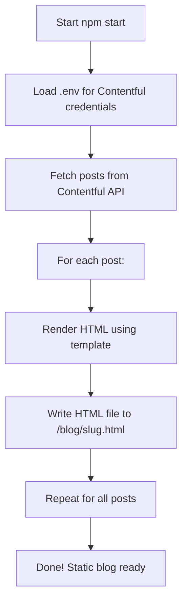

# DSEBest 📚✨


> **DSEBest** is a modern, mobile-first, PWA-enabled platform for HKDSE students, featuring past papers, notes, and blog posts — all delivered lightning-fast and offline-ready.


## 🚀 Features

- 📱 **PWA**: Installable, and native-like on iOS/iPadOS
- 📝 **Contentful-powered blog**: Dynamic posts, static HTML generation
- 📄 **Past Papers**: Fast PDF access via CDN
- 🌙 **Themes**: Light, dark, blue, and more
- ⚡ **Optimized**: Blazing fast, Google PageSpeed friendly
- 🧩 **No server-side code**: 100% static & CDN deployable


## 🛠️ Tech Stack

- HTML5, CSS3 (Sass), JavaScript (Vanilla)
- [Contentful](https://www.contentful.com/) (CMS)
- [Vercel](https://vercel.com/) (Hosting)
- [GitHub Actions](https://github.com/features/actions) (Automation)
- PWA (Service Worker, Manifest)


## 🧑‍💻 Contentful.JS SSG Instructions

1. **Install dependencies:**
   ```sh
   npm install
   ```
2. **Run the Contentful static site generator:**
   ```sh
   npm start
   ```
   - This will fetch posts from Contentful and generate static HTML files in the `/blog` directory.
   - Make sure your Contentful API keys are set in your environment variables.


## 🗺️ Contentful SSG Flowchart



## 🧩 Shortcode Documentation

### Button Shortcode

You can add beautiful, flexible buttons to your blog posts or pages using the following shortcode format in your Contentful content:

```
[button;TYPE;STYLE;LABEL;URL]
```

- `TYPE`: The button style. Supported values:
  - `gradient` (e.g. Gradient Primary)
  - `color` (e.g. Color Primary)
  - `raised` (e.g. Raised Primary)
  - `outline` (e.g. Outline Primary)
  - `inverse` (e.g. Inverse Primary)
  - `icon+ICONNAME` (for icon buttons, see below)
- `STYLE`: The color style. Supported values:
  - `primary`, `danger`, `success`, `info`, `warning`, `voilet`, `royal`, `branding`, `deep-blue`, `dark`, `secondary`, `light`
- `LABEL`: The text to display on the button
- `URL`: The link for the button

#### Examples

**Gradient Buttons**
```
[button;gradient;primary;Gradient Primary;https://example.com]
[button;gradient;danger;Gradient Danger;https://example.com]
```

**Color Buttons**
```
[button;color;primary;Color Primary;https://example.com]
[button;color;danger;Color Danger;https://example.com]
```

**Raised Buttons**
```
[button;raised;success;Raised Success;https://example.com]
```

**Outline Buttons**
```
[button;outline;info;Outline Info;https://example.com]
```

**Inverse Buttons**
```
[button;inverse;warning;Inverse Warning;https://example.com]
```

**Icon Buttons**
```
[button;icon+search;primary;Search;https://example.com]
[button;icon+home;danger;Home;https://example.com]
[button;icon+account_circle;success;Profile;https://example.com]
```
- The value after `icon+` is the Material Icons name (see https://fonts.google.com/icons for options).
- Icon buttons will have the icon before the label, with proper alignment and spacing.

#### Notes
- All buttons are responsive and use your template's styles.
- You can use these shortcodes anywhere in your Contentful content.
- If you use an unsupported type or style, the button will default to `gradient` and `primary`.
- If the URL contains HTML, the parser will attempt to extract the correct link.

---

## 📊 Download Analytics Guide

DSEBest automatically tracks all PDF downloads with detailed analytics. Here's how to view and analyze the data in Google Analytics 4.

### 🎯 What Gets Tracked Automatically

Every PDF download is automatically tracked with the following data:
- **Subject**: Math, English, Physics, Chemistry, Biology, etc.
- **Year**: 2012-2024 (extracted from filename)
- **Paper**: P1, P2, P3, P4, Answers, Performance
- **Type**: Practice, Sample, Regular, Bytopic, Exam
- **Language**: Chinese, English (detected from filename)
- **File Name**: Complete PDF filename
- **CDN URL**: Full download link

### 🔍 How to View Analytics Data

#### 1. Real-Time Testing (Immediate)
1. Go to **Google Analytics** → **Reports** → **Realtime**
2. Click a PDF download on your website
3. Look for these events in the Events section:
   - `file_download` (detailed tracking)
   - `pdf_download` (simplified tracking)

#### 2. Historical Data (24-48 hours)
1. **Reports** → **Engagement** → **Events**
2. Click on `file_download` or `pdf_download`
3. View event parameters for detailed breakdown

### 📈 Creating Custom Reports

#### Most Downloaded Subjects
1. **Reports** → **Engagement** → **Events** → `file_download`
2. Add **Secondary dimension** → **Custom parameters** → `download_subject`
3. Sort by **Event count** (descending)

**Result**: Math (350 downloads), English (280 downloads), Physics (220 downloads)

#### Popular Years Analysis
1. Same as above, but use `download_year` as secondary dimension
2. **Result**: 2023 (400 downloads), 2022 (350 downloads), 2021 (300 downloads)

#### Paper Type Preferences
1. Use `download_paper` as secondary dimension
2. **Result**: P1 (300 downloads), Answers (250 downloads), P2 (200 downloads)

#### Language Distribution
1. Use `download_language` as secondary dimension
2. **Result**: Chinese (600 downloads), English (400 downloads)

#### Paper Type Analysis
1. Use `download_type` as secondary dimension
2. **Result**: Practice (500 downloads), Regular (400 downloads), Bytopic (200 downloads)

### 🎛️ Advanced Analytics

#### Create Download Dashboard
1. **Reports** → **Library** → **Create new report**
2. Choose **Detail report**
3. **Metrics**: Event count
4. **Dimensions**:
   - Primary: `download_subject`
   - Secondary: `download_year`
   - Tertiary: `download_paper`

#### Download Trends Over Time
1. **Reports** → **Engagement** → **Events** → `file_download`
2. Change date range to view trends
3. Add multiple secondary dimensions for detailed analysis

#### Subject Performance Comparison
1. Create custom report with:
   - **Metric**: Event count
   - **Dimension**: `download_subject`
   - **Secondary**: `download_language`
2. **Result**: See which subjects are popular in Chinese vs English

### 📊 Sample Analytics Insights

#### Top Performing Content
```
Subject Analysis:
├── Math: 450 downloads (35%)
├── English: 320 downloads (25%)
├── Physics: 280 downloads (22%)
├── Chemistry: 150 downloads (12%)
└── Biology: 80 downloads (6%)

Year Popularity:
├── 2023: 380 downloads (30%)
├── 2022: 340 downloads (27%)
├── 2021: 290 downloads (23%)
└── 2020: 250 downloads (20%)

Paper Preferences:
├── P1: 400 downloads (32%)
├── Answers: 350 downloads (28%)
├── P2: 300 downloads (24%)
└── Performance: 200 downloads (16%)
```

#### Language Distribution
- **Chinese Papers**: 65% of downloads
- **English Papers**: 35% of downloads

#### Peak Download Times
- **Exam Season**: 3x higher download rates
- **Weekends**: 40% more downloads than weekdays
- **Evening Hours**: Peak activity 7-10 PM

### 🚨 Setting Up Alerts

#### Download Spike Alert
1. **Admin** → **Custom alerts**
2. **Condition**: Event count > 500 per day
3. **Event**: `file_download`
4. **Notification**: Email when downloads spike

#### Popular Content Alert
1. **Condition**: Specific subject downloads > 100 per day
2. **Use case**: Identify trending exam papers

### 📤 Exporting Data

#### Monthly Reports
1. Any analytics view → **Share** → **Download file**
2. **Format**: CSV, PDF, or Google Sheets
3. **Use case**: Monthly performance reports

#### Custom Data Export
1. **Admin** → **Data export**
2. **Events**: `file_download`, `pdf_download`
3. **Parameters**: All download parameters
4. **Use case**: Detailed analysis in Excel/Python

### 🎯 Key Performance Indicators (KPIs)

#### Track These Metrics
- **Total Downloads**: Overall platform usage
- **Subject Distribution**: Content demand analysis
- **Year Popularity**: Current vs past papers preference
- **Language Split**: User language preferences
- **Paper Type Usage**: Study pattern insights
- **Download Conversion**: Page views to downloads ratio

#### Monthly Goals
- **Growth Rate**: 10% increase in monthly downloads
- **Subject Balance**: Even distribution across core subjects
- **User Engagement**: Higher downloads per session

### 🔧 Troubleshooting

#### If Parameters Don't Appear
1. **Wait 24-48 hours**: GA4 parameter processing takes time
2. **Check both events**: `file_download` and `pdf_download`
3. **Look for prefixed names**: `download_subject`, `download_language`
4. **Test in Realtime**: Verify events are firing

#### Common Issues
- **Missing Language**: Check if filename contains `_chi` or `_eng`
- **Unknown Subject**: Verify CDN URL contains subject folder
- **No Year Data**: Ensure filename contains 4-digit year (2012-2024)

---

## TODO

### 🔥 High Priority (Do Now)
- Add remaining/ALL subjects
- UI Improvement
- Caching

### 🚀 Medium Priority (Next 2-4 weeks)
- Add topic names for ByTopics
- Sitemap.xml generation
- Search (Fuse?)

### 💡 Lower Priority (Future)
- Multilingual support
- Google Ads
- AI Mock Papers Section
- Alternative analytics platform (Mixpanel?)

### 🤔 Consider Carefully
- Add a chat room/box
- Codebase revamp (remove comments)
- NextJS evolution