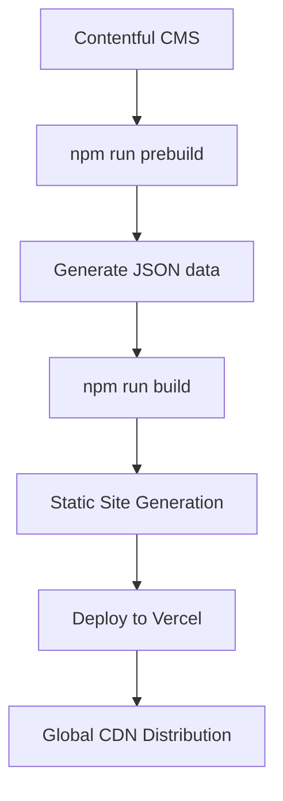

# DSEBest v2.0 ��📚

> **DSEBest** has evolved into a modern Next.js-powered platform for HKDSE students, featuring past papers, dynamic blog posts, and comprehensive study resources — all delivered through a lightning-fast, PWA-enabled experience.

## ✨ What's New in v2.0 (Next.js Evolution)

### � **Complete Architecture Overhaul**
- **From Static HTML → Next.js 15** with React 19
- **Server-Side Generation (SSG)** for optimal performance
- **TypeScript** throughout for better code quality
- **Enhanced PWA** with native iOS feel
- **Advanced Security Headers** for production-grade security

### � **Performance & UX Improvements**
- **Framer Motion** animations for smooth page transitions
- **Optimized bundle splitting** and code elimination
- **Enhanced SEO** with dynamic meta tags
- **Responsive design** optimized for all devices
- **Offline-first** PWA experience

### 📱 **Mobile-First PWA Features**
- **Installable** on iOS, Android, and Desktop
- **Native iOS gestures** and scroll behavior
- **Standalone app mode** with custom splash screens
- **Background sync** for offline content access

## 🛠️ Modern Tech Stack

### **Frontend Framework**
- **Next.js 15** (React 19, TypeScript)
- **Framer Motion** for animations
- **Bootstrap 5.3** with custom themes
- **Sass/SCSS** for advanced styling

### **Content Management**
- **Contentful CMS** with rich text rendering
- **Static generation** at build time
- **Dynamic imports** for optimal loading

### **Performance & Security**
- **Vercel Edge Network** deployment
- **Security headers** (CSP, HSTS, XSS protection)
- **Automatic optimization** (images, fonts, scripts)
- **Console.log removal** in production

### **Development & Deployment**
- **TypeScript** with strict type checking
- **ESLint** for code quality
- **Git workflow** with automated deployments
- **Environment variable** management

## 🚀 Quick Start

### **Development**
```bash
# Install dependencies
npm install

# Start development server
npm run dev

# Access at http://localhost:3000
```

### **Production Build**
```bash
# Generate blog data from Contentful
npm run prebuild

# Build for production
npm run build

# Start production server
npm start
```

### **Blog Content Management**
```bash
# Sync latest blog posts from Contentful
npm run blog:sync

# Full build with fresh content
npm run build:full
```

## 📁 Project Structure

```
├── pages/                  # Next.js pages (SSG)
│   ├── _app.tsx           # App wrapper with themes
│   ├── _document.tsx      # HTML document structure
│   ├── index.tsx          # Homepage
│   ├── [subject].tsx      # Subject pages
│   └── blog/
│       ├── index.tsx      # Blog listing
│       └── [slug].tsx     # Individual blog posts
├── components/            # Reusable React components
├── utils/                 # Utility functions
├── hooks/                 # Custom React hooks
├── types/                 # TypeScript type definitions
├── public/               # Static assets
│   ├── config/           # Subject configurations
│   ├── assets/           # Images, fonts, styles
│   └── manifest.json     # PWA manifest
├── data/                 # Generated blog data
└── contentful/           # Content generation scripts
```

## 🎨 Features & Capabilities

### **Study Resources**
- 📄 **Past Papers** for all HKDSE subjects (2012-2024)
- 📚 **Subject Pages** with organized resources
- 🔍 **Quick navigation** between years and papers
- 📱 **Mobile-optimized** PDF viewing

### **Dynamic Blog**
- ✍️ **Contentful-powered** content management
- 🏷️ **Rich text rendering** with embedded media
- 🔗 **SEO-optimized** with meta tags and structured data
- 📊 **Static generation** for fast loading

### **Progressive Web App**
- 📲 **Installable** on all devices
- 🔄 **Offline support** with service worker
- 🎯 **Native app feel** especially on iOS
- 🔔 **Push notifications** ready (when needed)

### **Theming System**
- 🎨 **Multiple themes**: Light, Dark, Blue, Semi-dark, Bordered
- 💾 **Persistent theme** selection
- 🔄 **Smooth transitions** between themes
- 📱 **System preference** detection

## 🔧 Configuration

### **Environment Variables**
```bash
# Contentful CMS
CONTENTFUL_SPACE_ID=your_space_id
CONTENTFUL_ACCESS_TOKEN=your_access_token
CONTENTFUL_ENVIRONMENT=master

# Optional: Preview mode
CONTENTFUL_PREVIEW_ACCESS_TOKEN=your_preview_token
```

### **Vercel Deployment**
```json
{
  "framework": "nextjs",
  "buildCommand": "npm run build:full",
  "installCommand": "npm install",
  "outputDirectory": ".next"
}
```

## 🔒 Security Features

- **Content Security Policy (CSP)** preventing XSS attacks
- **HTTP Strict Transport Security (HSTS)** enforcing HTTPS
- **X-Frame-Options** preventing clickjacking
- **Referrer Policy** controlling information leakage
- **Permissions Policy** restricting browser features

## 📈 Performance Optimizations

### **Build-time Optimizations**
- **Static Site Generation (SSG)** for all pages
- **Automatic code splitting** by Next.js
- **Tree shaking** removing unused code
- **Console.log removal** in production builds

### **Runtime Optimizations**
- **Prefetching** critical resources
- **Image optimization** with Next.js Image component
- **Font optimization** with Google Fonts
- **Script optimization** with consolidated inline scripts

### **CDN & Caching**
- **Vercel Edge Network** global distribution
- **Automatic caching** headers by Vercel
- **Static asset** optimization
- **Gzip compression** enabled

## 🧑‍💻 Development Workflow

### **Adding New Content**
1. **Blog Posts**: Add via Contentful CMS
2. **Subject Resources**: Update JSON configs in `/public/config/`
3. **Static Pages**: Create new `.tsx` files in `/pages/`

### **Content Generation Flow**


### **Theme Development**
1. **SCSS files** in `/public/sass/`
2. **Compile** to CSS with build process
3. **Theme switching** handled by JavaScript
4. **Persistent storage** in localStorage

## 🌐 Deployment

### **Vercel (Recommended)**
- **Automatic** deployments from Git
- **Preview** deployments for pull requests
- **Edge network** for global performance
- **Analytics** and monitoring included

### **Manual Deployment**
```bash
# Build static files
npm run build:full

# Deploy .next/out/ to any static host
```

## 📊 Analytics & Monitoring

- **Google Analytics 4** for user behavior tracking
- **Vercel Analytics** for performance insights
- **Vercel Speed Insights** for Core Web Vitals
- **Error tracking** with React error boundaries

## 🤝 Contributing

1. Fork the repository
2. Create feature branch (`git checkout -b feature/amazing-feature`)
3. Commit changes (`git commit -m 'Add amazing feature'`)
4. Push to branch (`git push origin feature/amazing-feature`)
5. Open Pull Request

## 📄 License

This project is licensed under the ISC License - see the [LICENSE](LICENSE) file for details.

## 🎯 Roadmap

- [ ] **Enhanced PWA** features (background sync, push notifications)
- [ ] **User accounts** and personalized study plans
- [ ] **Interactive practice** questions
- [ ] **AI-powered** study recommendations
- [ ] **Multi-language** support (English/Traditional Chinese)
- [ ] **Dark mode** enhancements
- [ ] **Advanced search** functionality

---

**Built with ❤️ for HKDSE students** | **Powered by Next.js & Vercel**
    F --> G[Repeat for all posts]
    G --> H[Done! Static blog ready]

## 🧩 Shortcode Documentation

### Button Shortcode

You can add beautiful, flexible buttons to your blog posts or pages using the following shortcode format in your Contentful content:
```js
[button;TYPE;STYLE;LABEL;URL]
```


## TODO
- Enrich index features (Daily Quote)
- More Subjects
- Redis based chat moderation (User Data logging, bans, handle commands instead of maps which destroy upon vercel execution)
- Third party push notif for chat
- UI Improvement (Blog, Download cards etc)
- Completely redesign countdown with all subjects
- Blog post contentful react implementation 
- Blog post FAQPage JSONLD generation from CTF data
- Improve SEO meta descriptions and titles
- Fix material icon and button shortcodes in BlogGeneration
- Schema / Google Rich Results optimizations/FAQ?/Breadcrumbs ETC
- Validate all downloads (Anti Scraping)
- Block scraping of PDFs (Anti Scraping)
- Signed URLs for downloading with expiry (Anti Scraping)
- PageSpeed improvements 
- Add topic names for ByTopics
- Sitemap.xml generation
- Search (Fuse?)
- Multilingual support
- Codebase revamp 
- Disqus comment count in blog
- Generative Engine Optimization (GEO)
- CF Plugins
- Chat Auth Vulne improvement

### Pages suggestions
- PRIORITY!!!!! CUT OFF  PAGE AND COLLECTIN!!!!!!!!!!!!!!!!!!!!!!!!!!! (SOURCE FROM PERPLEXITY)
- AI Mock Papers Section
- Study Locations Google Maps
- Countdown timer for each subjects
- Random Speaking Question Trainer
